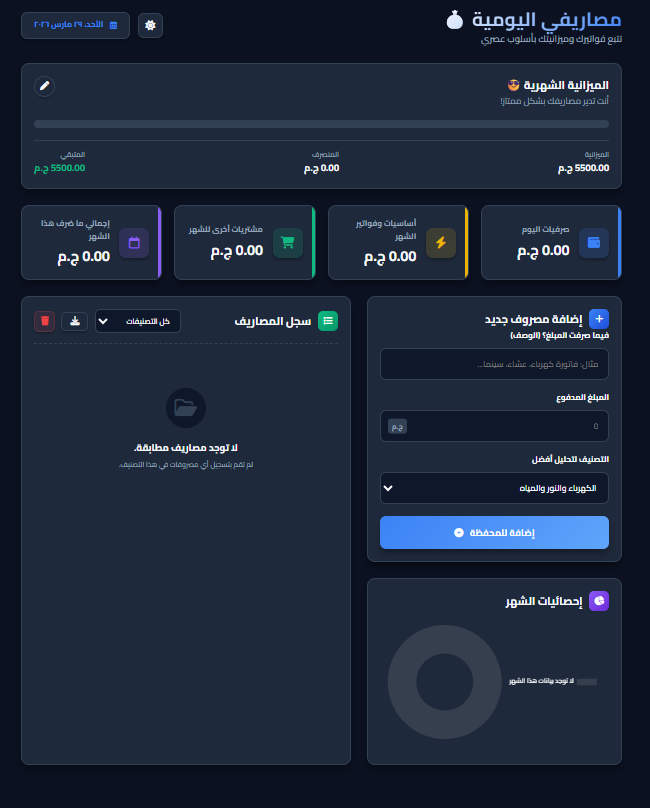

# 💰 Masarify - Modern Personal Finance Tracker



**Masarify (مصاريفي اليومية)** is a sleek, high-performance web application designed to help users track their daily expenses and manage their monthly budgets with an intuitive and secure interface.

---

## ✨ Key Features

* **📊 Dynamic Dashboard:** Real-time overview of your monthly budget, spent amount, and remaining balance.
* **💸 Expense Categorization:** Add expenses with detailed descriptions and categories (Utilities, Shopping, etc.).
* **📈 Visual Analytics:** Interactive donut charts to visualize spending patterns at a glance.
* **🌙 Modern Dark UI:** A professional dark-themed interface designed for focus and eye comfort.
* **📱 Fully Responsive:** Optimized for various screen sizes, from mobile to desktop.
* **🔒 Privacy-First:** Data is stored locally in the browser's `LocalStorage` (No sensitive data is sent to external servers).

---

## 🛠️ Tech Stack

| Component | Technology |
| :--- | :--- |
| **Frontend** | HTML5, CSS3 (Modern Grid/Flexbox), JavaScript (ES6+) |
| **Charts** | Chart.js (or custom SVG logic) |
| **Icons** | FontAwesome / Boxicons |
| **Storage** | Client-side LocalStorage |

---

## 🛡️ Security Highlights

As a **Cybersecurity** enthusiast, I built this application with the following principles:
* **Input Sanitization:** Robust handling of user inputs to prevent **Stored XSS** (Cross-Site Scripting) vulnerabilities.
* **Client-Side Integrity:** Ensuring that all calculations and data persistence happen within the user's secure environment.
* **No Tracking:** Zero telemetry or third-party tracking scripts for maximum user privacy.

---

## 🚀 How to Run

1.  **Clone the repository:**
    ```bash
    git clone [https://github.com/Ziad_0x/masarify.git](https://github.com/Ziad_0x/masarify.git)
    ```
2.  **Open the project:**
    Navigate to the project folder and open `index.html` in any modern web browser.

---

## 👨‍💻 Author

**Ziad Mohamed (Ziad_0x)** *Computer Science Student & Security Researcher* *Specialized in Web Penetration Testing & Bug Bounty Hunting*

---

> "Empowering users to take control of their financial data securely."
